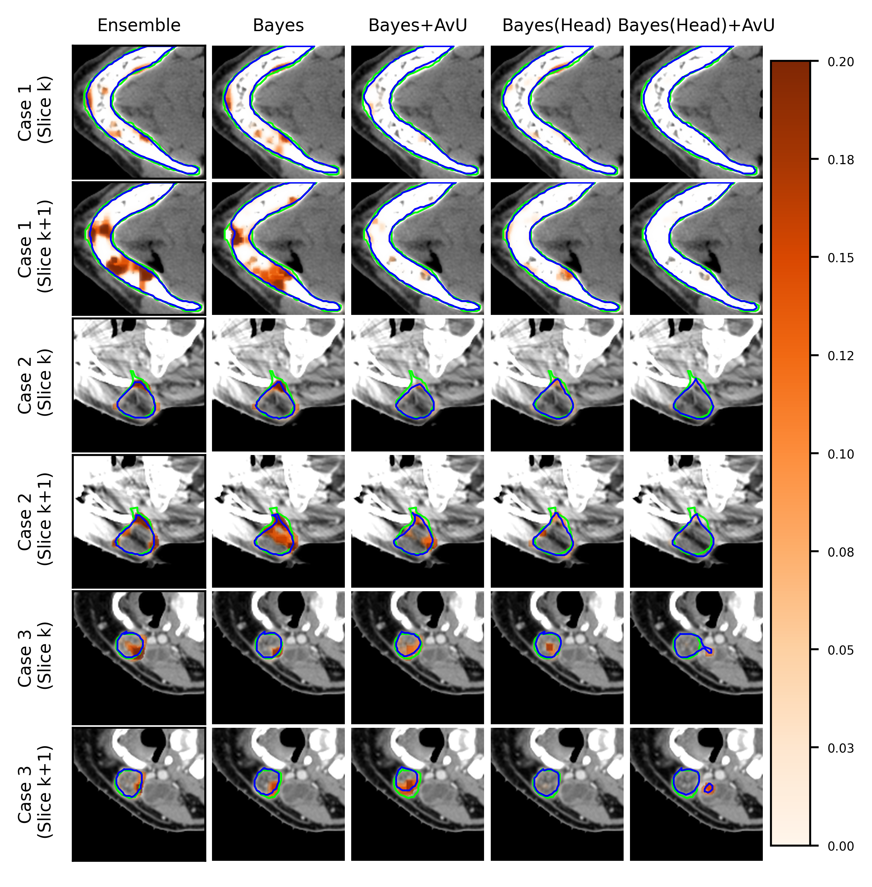
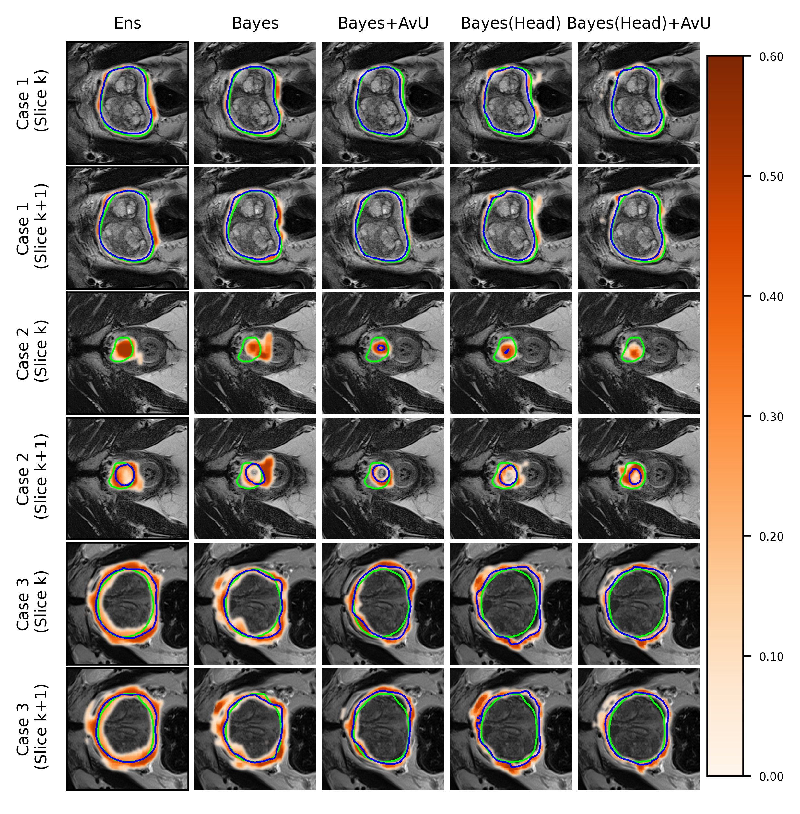
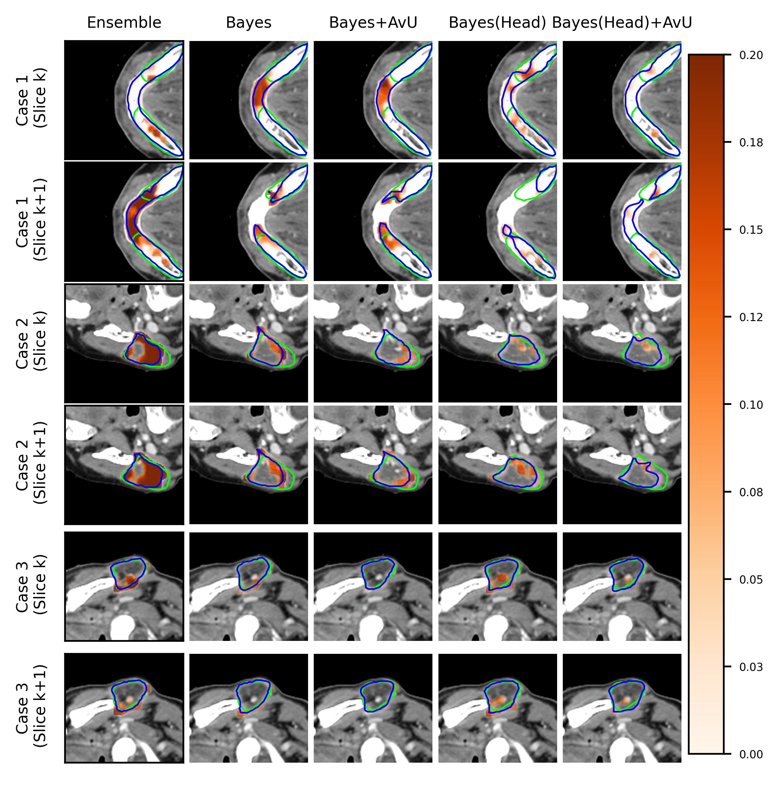
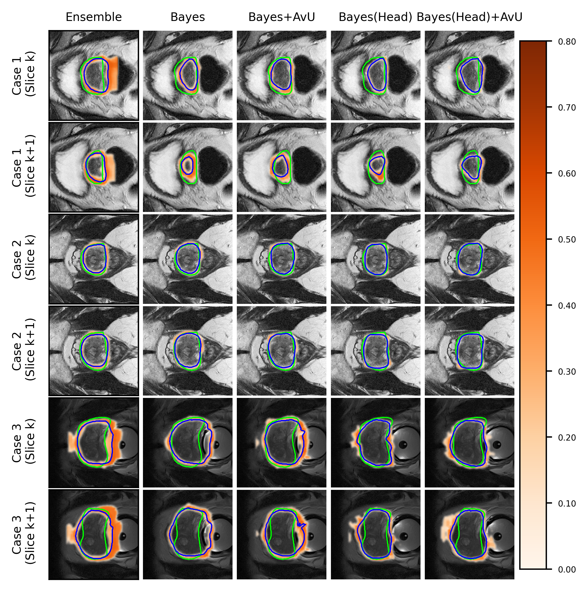

# Improving Uncertainty-Error Correspondence in Deep Bayesian Medical Image Segmentation
Increased usage of automated tools like deep learning in medical image segmentation has alleviated the bottleneck of manual contouring. **This has shifted manual labour to quality assessment (QA) of automated contours which involves detecting errors and correcting them**. A potential solution to semi-automated QA is to use deep Bayesian uncertainty to recommend potentially erroneous regions, thus reducing time spent on error detection. Previous work has investigated the correspondence between uncertainty and error, **however, no work has been done on improving the “utility” of Bayesian uncertainty maps such that it is only present in inaccurate regions and not in the accurate ones**. Our work trains the FlipOut model with the Accuracy-vsUncertainty (AvU) loss which promotes uncertainty to be present only in inaccurate regions. We apply this method on datasets of two radiotherapy body sites, namely CT scans of head and neck and prostate MRs. Uncertainty heatmaps (i.e. predictive entropy) are evaluated using ROC and Precision-Recall curves. Numerical results show that when compared to the Bayesian baseline the proposed method successfully suppresses uncertainty for accurate voxels, with similar presence of uncertainty for inaccurate voxels.

![In this visual abstract, we indicate the inputs, outputs and loss functions used in our method. A 3D medical scan (e.g.CT/MR) is input into a UNet-based Bayesian neural net to produce both predicted contours (Pred) and predictive uncertainty(Unc). While the cross-entropy loss is used to improve segmentation performance, the Accuracy-vs-Uncertainty (AvU) loss is used to improve uncertainty-error correspondence. The AvU loss compares the prediction with the ground truth (GT) to extract four terms: count of accurate-and-certain nAC, accurate-and-uncertain nAU, inaccurate-and-certain nIC and inaccurateand-uncertain nIU.](./assets/visual-abstract.jpg " In this visual abstract, we indicate the inputs, outputs and loss functions used in our method. A 3D medical scan (e.g.CT/MR) is input into a UNet-based Bayesian neural net to produce both predicted contours (Pred) and predictive uncertainty (Unc). While the cross-entropy loss is used to improve segmentation performance, the Accuracy-vs-Uncertainty (AvU) loss is used to improve uncertainty-error correspondence. The AvU loss compares the prediction with the ground truth (GT) to extract four terms: count of accurate-and-certain nAC, accurate-and-uncertain nAU, inaccurate-and-certain nIC and inaccurateand-uncertain nIU.")

# Results
## Visual Results
|Head and Neck CTs|Prostate MRs|
| --- | --- |
|||
|||

# To reproduce results
1. This repo allows us to evaluate uncertainty-error correspondence on two radiotherapy body-sites (head and neck CTs and prostate MRs). The data is not included in this repo, but can be downloaded from the following links:
    - Head and neck CTs:
        - RTOG trial (Train/Test)
            - [MICCAI2015 Head and Neck Segmentation Challenge](http://www.imagenglab.com/wiki/mediawiki/index.php?title=2015_MICCAI_Challenge)
            - [DeepMindTCIA](https://github.com/deepmind/tcia-ct-scan-dataset/tree/master/nrrds/test/oncologist) (remove scans also present in MICCAI2015)
        - [StructSeg](https://structseg2019.grand-challenge.org) (Test) 
    - Prostate MRs: 
        - [ProstateX](https://wiki.cancerimagingarchive.net/pages/viewpage.action?pageId=61080779#61080779eafef8e13d0143939c02c28f1e84e240) (Train)
        - [Medical Decathlon - Task 5](https://drive.google.com/file/d/1Ff7c21UksxyT4JfETjaarmuKEjdqe1-a/view?usp=drive_link) (Test)
        - [PROMISE12](https://promise12.grand-challenge.org) (Test)

2. Use [train-hn.py](./src/train-hn.py) and [train-pros.py](./src/train-pros.py)
3. Evaluation functions can be found in [eval-hn.py](./src/eval-hn.py) and [eval-pros.py](./src/eval-pros.py)

# Closing thoughts
Given that deep learning models have shown the capability of reaching near expert-level performance in medical image segmentation, their next evolution is improved robustness and clinical utility. Our work shows progress on this front for two radiotherapy datasets using a uncertainty-driven loss in a Bayesian setting. We hope the community is inspired by our positive results to further contribute to human-centric approaches to deep learning-based modeling.